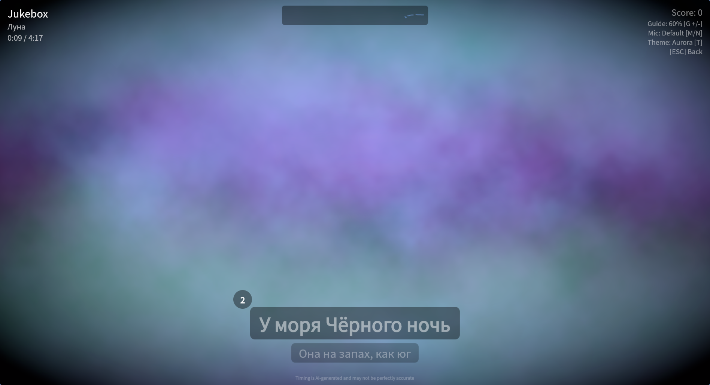
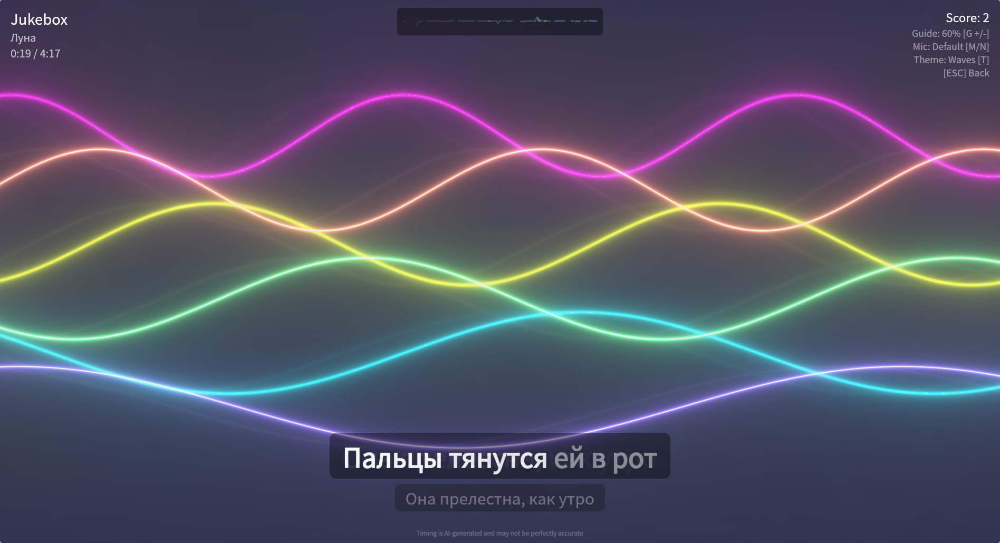

# Backgrounds

Nightingale offers a deep selection of background themes during playback, cycled with the `T` key.

## 10 GPU Shader Backgrounds

Ten backgrounds are rendered in real-time using GPU shaders (GLSL):

1. **Plasma** — flowing colorful plasma effect
2. **Waves** — undulating wave patterns
3. **Nebula** — cosmic nebula clouds
4. **Starfield** — deep space star field
5. **Sonar** — radial pulse sweeps
6. **Voronoi** — animated cellular tessellation
7. **Vortex** — swirling color tunnels
8. **Metaballs** — fluid blob morphs
9. **Spectrum** — frequency-bar visualizer
10. **Oscilloscope** — waveform line trace

These run at full frame rate and adapt to your display resolution.

Shaders are **audio-reactive** when the microphone is enabled: a real-time analyzer drives shared uniforms (level, low/mid/high band energy, beat impulses) so louder vocals push the visuals harder. With the mic off, the shaders animate on their own time-based clock.

<!-- TODO: 2-3 screenshots showing different shader backgrounds (e.g. Nebula and Spectrum) during playback -->

## Pixabay Video Backgrounds

Pre-downloaded video backgrounds from [Pixabay](https://pixabay.com/) in 5 flavors, cycled with the `F` key:

1. **Nature** — forests, mountains, rivers
2. **Underwater** — ocean, coral, sea life
3. **Space** — galaxies, nebulae, Earth from orbit
4. **City** — urban skylines, night cityscapes
5. **Countryside** — rolling fields, sunsets

Videos are pre-downloaded during setup so they're ready instantly.

## Source Video Playback

When playing a video file (`.mp4`, `.mkv`, etc.), the source video plays as the background automatically. If the source is not directly playable, Nightingale generates a compatible playback version in cache.

Source video background timing follows playback tempo, so visual sync stays consistent when tempo is adjusted.
